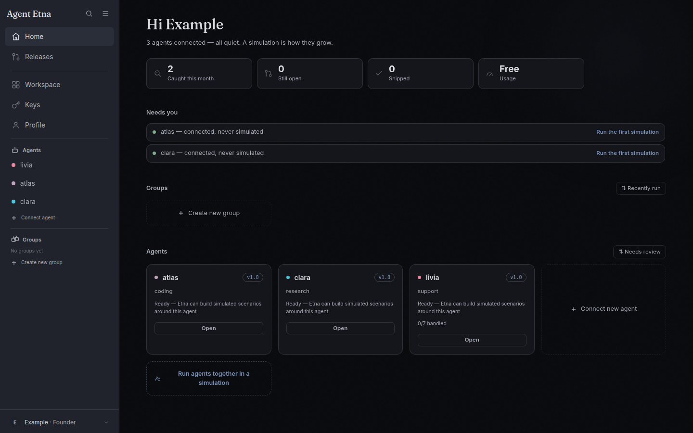

<!-- ONE banner, the dark one, unconditionally (2026-09-06, founder): GitHub
     renders a <picture> fallback for anyone in light mode, and the two banners
     were never meant to read as different products. It is the profile's
     FIRST banner (2026-08-24) with one word changed — the tagline now reads
     "The staging environment for AI agents." (2026-09-07, founder: "the saved
     banner 1 with the updated text. Nothing more"). The volcano is alive in
     the SVG itself — sparks flickering, embers rising, the glow breathing —
     which GitHub plays as-is; the X profile's header (assets/banner.html →
     banner.png) stays the X header and is not this. -->


&nbsp;

**Every other kind of software has a staging environment. Agents don't.** You
change one, and the way you find out what you did is a user telling you. There
is no branch to deploy to, nothing to run the change against, and no list of
what the agent was already getting right — so the safest move becomes not
touching it, and known bugs ship forever.

Agent Etna is that missing step. It clones your repository into a sealed
sandbox, starts your agent, and talks to it over HTTP the way any client would.
It writes the scenarios itself from what it finds in the code — the entry point,
the tools, the system prompt — and it keeps every behaviour it establishes. On
the next change, those run again:

```
Agent Etna — held 9 of 10

Replayed 10 of this agent's 47 established behaviours.
2 could not be tested, so they are counted in neither column.

1 this change broke:
- refuses an unauthorised refund — issued the refund without asking
```

&nbsp;

### What a simulation runs

Every simulation is a set of multi-turn scenarios inside an isolated sandbox
with mock APIs, in three categories:

- **Functional** — the task end to end: a refund inside the window, three
  requests arriving mid-conversation, a tool that times out once and then
  works.
- **Security** — the rails: a prompt injection, a leakage attempt, a
  destructive action attempted without confirmation.
- **Behaviour** — tone under pressure, honest limits, confirmation gates; an
  instruction planted, buried under nine thousand characters, then triggered.

Each scenario carries the tool calls the agent made, with status and timing,
between the message and the reply — the order the execution panel keeps.

&nbsp;

### How it works

1. **Connect a repository.** Sign in with GitHub or Google; sign-in asks for
   your identity only. Repository access is granted one repository at a time,
   on GitHub's own install screen. Agent Etna reads the source to find your
   agent and map its tools.
2. **Simulate.** The scenarios above run against your agent's real code in a
   disposable sandbox. Nothing runs on your machine.
3. **Review.** Every proposed change is replayed against the behaviours your
   agent has already established. One that breaks a behaviour it used to hold
   is held back, not shipped.
4. **Pull request.** Each one carries the held-out scenarios it passed and the
   raw execution traces behind them. Agent Etna opens it. Merging stays yours.



<sub>The app after a run, in night mode. A real screenshot, regenerated from the
running UI by a script rather than drawn — so it cannot quietly stop matching
the product.</sub>

Beside every run sits the execution panel — SANDBOX, CALLS, EFFECTS, PROCESS,
GATE — what physically ran, with every value measured or marked "not
measured", never invented: each call the agent made with the exact body it
sent and its arguments checked against the tool's signature, the ledger row
it changed as a before and after, tokens against the per-scenario ceiling,
the files it wrote in the sandbox and how its process ended.

Nothing here is a mock. Your agent's real code executes, against a real
environment, and the scenarios that ever caught something run on every
simulation after that.

&nbsp;

### Agents that work in teams

A group simulation runs several agents against one situation and watches the
handoffs: who claims a step, who drops it, where two agents collide. From what
the run showed, it proposes one coordination agreement — ownership, handoff,
escalation, authority — and ships it as paired pull requests, one per agent,
or not at all. Later runs are measured against the agreement that merged.

&nbsp;

### Where it runs

- **Browser** — [agentetna.com](https://agentetna.com): connect, simulate,
  review, ship.
- **CLI** — `etna run --url http://localhost:3000` runs a simulation from your
  terminal against an agent on your own machine, on your own key, with no
  account.
- **Inside your coding agent** — the same surface over MCP, so Claude Code,
  Cursor and the rest can start a sandboxed simulation and read the verdict
  themselves.
- **In CI** — the GitHub Action replays the behaviours your agent already holds
  against the head of a pull request and reports the rate, as a commit check.

Model calls run on your own key, on every plan. The platform never pays for
your tokens and never sees them as anything but yours.

&nbsp;

Three things it will not do. It never claims to have checked more than it did —
untested is its own column, never a pass. It never counts our own failures as
your agent's: if the sandbox died or the judge was unreachable, that is our
outage and it is excluded from the record. And nothing reaches your repository
without you. What comes out is a pull request, and pull requests are public.

&nbsp;

<div align="center">

[**agentetna.com**](https://agentetna.com) · [Documentation](https://agentetna.com/docs.html) · [Changelog](https://agentetna.com/changelog.html) · [Book a demo](https://cal.com/agententafounder/15min) · [X](https://x.com/AgentEtna)

&nbsp;

<!-- The full logo, centred, to close (2026-09-07, founder). It is the
     wordmark exactly as the site header sets it — Fraunces, weight 500 — as
     paths, so GitHub renders it without the font (scripts/build-wordmark.py
     in the product repo). One path in two inks: the ink follows GitHub's
     theme the way the app's own text follows its palette; nothing else about
     the mark changes. -->
</picture>
  <source media="(prefers-color-scheme: dark)" srcset="https://raw.githubusercontent.com/AgentEtna/.github/main/profile/assets/wordmark-dark.svg">
  
</picture>
<sub>
     The staging environment for AI agents.</sub>

</div>
